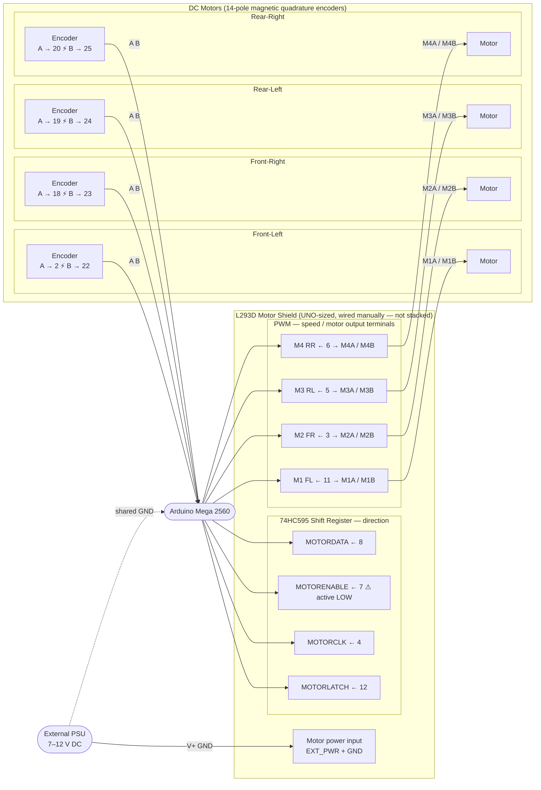

# TheRobot — Mecanum Drivetrain

Arduino Mega 2560 + AZDelivery L293D Motor Shield + 4× DC motors with quadrature encoders.

---

## Wiring



> **Note — pin 3 conflict:** pin 3 is claimed by M2 PWM and **cannot** be used as an encoder interrupt.
> ⚡ = external interrupt pin (RISING edge triggers ISR, reads channel B for direction).

### Pin reference tables

#### Motor Shield (L293D / 74HC595)

| Signal       | Mega pin | Notes                    |
|--------------|----------|--------------------------|
| Shift latch  | 12       | MOTORLATCH               |
| Shift clock  | 4        | MOTORCLK                 |
| Shift enable | 7        | MOTORENABLE (active LOW) |
| Shift data   | 8        | MOTORDATA                |
| M1 PWM (FL)  | 11       | Front-Left speed         |
| M2 PWM (FR)  | 3        | Front-Right speed        |
| M3 PWM (RL)  | 5        | Rear-Left speed          |
| M4 PWM (RR)  | 6        | Rear-Right speed         |

#### Encoders

| Motor          | Enc A (ext. interrupt) | Enc B (digital) |
|----------------|------------------------|-----------------|
| M1 Front-Left  | 2                      | 22              |
| M2 Front-Right | 18                     | 23              |
| M3 Rear-Left   | 19                     | 24              |
| M4 Rear-Right  | 20                     | 25              |

---

## Architecture

```
L293DShield          — shift register + PWM management
DCMotorWithEncoder   — single motor control + encoder feedback
MecanumDrivetrain    — mecanum kinematics for all 4 motors
Speed                — value-type: Percentage | WheelRPM | MotorRPM
Direction            — Left (CCW) | Right (CW)
```

---

## API

### `Speed`

```cpp
Speed::fromPercentage(float pct)  // 0–100
Speed::fromWheelRPM(float rpm)
Speed::fromMotorRPM(float rpm)
```

### `DCMotorWithEncoder`

```cpp
DCMotorWithEncoder motor(shield, motorNum, encA, encB,
                          countsPerRev, gearRatio, maxMotorRPM);

motor.setSpeed(float pct);           // -100 to +100
motor.setSpeedRPM(float motorRPM);
motor.setSpeedWheelRPM(float rpm);
motor.setSpeed(Speed speed);
motor.stop();

motor.rotateMotorRevolutions(float revs, float speedPct = 50);
motor.rotateMotorRevolutionsRPM(float revs, float motorRPM);
motor.rotateWheelRevolutions(float revs, float speedPct = 50);
motor.rotateWheelRevolutionsRPM(float revs, float motorRPM);

motor.getEncoderCount();  // raw counts
motor.resetEncoder();
motor.getMotorRPM();
motor.getWheelRPM();
motor.isRunning();        // true while rotation target active
motor.update();           // call every loop()
```

### `MecanumDrivetrain`

```cpp
MecanumDrivetrain dt(fl, fr, rl, rr, trackWidth_mm, wheelBase_mm);

// Strafe without rotation
dt.strafe(float x, float y, Speed speed = 50%);

// Strafe + rotation (x, y, rotation all in [-1, 1])
// rotation > 0 → CCW, < 0 → CW
dt.strafe(float x, float y, float rotation, Speed speed = 50%);

// Circle around a fixed centre point
// Direction::Left  → orbit CCW (robot moves laterally right)
// Direction::Right → orbit CW  (robot moves laterally left)
dt.circle(float radius_mm, Direction dir, Speed speed = 50%);

dt.stop();
dt.update();  // call every loop()
```

---

## Mecanum Kinematics

```
v_FL =  Vy + Vx - ω
v_FR =  Vy - Vx + ω
v_RL =  Vy - Vx - ω
v_RR =  Vy + Vx + ω
```

`ω` > 0 = CCW rotation. Values are normalised so max |v| = 1 before scaling.

**Circle mapping** (`Leff = (trackWidth + wheelBase) / 4`):

- `Direction::Left`  (CCW): `Vx = +1`, `ω = +Leff / radius`
- `Direction::Right` (CW):  `Vx = -1`, `ω = -Leff / radius`

---

## Running Tests

```bash
# Native (PC-side, no hardware required)
pio test -e native

# On-device
pio test -e megaatmega2560
```
